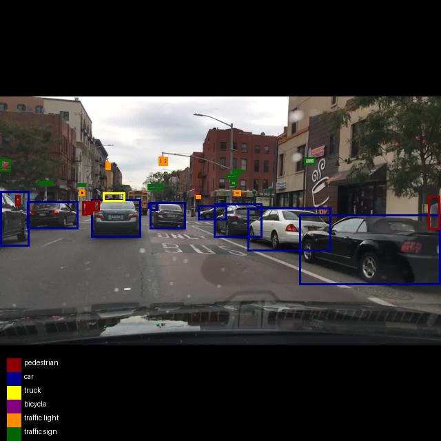

# Traffic Object Detection Using YOLOv11


This project leverages YOLOv11 and multiple datasets to train a model for object detection in traffic scenarios. The goal is to detect cars, trucks, bicycles, pedestrians, traffic lights, and German traffic signs. The project is structured as follows:

### Hardware
- **Training and Data Preprocessing**: Utilizing an HPC cluster provided by the university, featuring an NVIDIA A100 GPU (80 GB).
- **Real-Time Detection**: Testing on a laptop (Dell XPS 13 with Intel i7-10510U CPU @ 1.80 GHz and 16 GB RAM).
- **Camera**: [Logitech Webcam (720p)](https://www.logitech.com/de-de/products/webcams/c270-hd-webcam.960-001063.html).

### Datasets
- **[GTSDB](https://benchmark.ini.rub.de/gtsdb_news.html)**: German Traffic Sign Detection Benchmark for traffic signs.
- **[BDD100k](https://bair.berkeley.edu/blog/2018/05/30/bdd/)**: General traffic object detection dataset.
- **[AudiA2D2](https://www.a2d2.audi/a2d2/en.html)**: German traffic object detection dataset.

## Approach
1. **Data Preprocessing**:
   - Ensure compatibility with YOLOv11 format.
   - Convert semantic segmentation datasets (Audi A2D2) into bounding boxes.
2. **Training on Traffic Signs**:
   - Train a YOLOv11x model on the GTSDB dataset to predict traffic sign labels.
3. **Object Detection**:
   - Train a YOLOv11m model on the BDD100k dataset to handle general object detection, focusing on real-time performance on a CPU.
4. **Pseudolabeling**:
   - Use the trained YOLOv11x model to generate labels for Audi A2D2 datasets for German traffic signs.
   - Use the trained YOLOv11m model to generate labels for the GTSDB dataset for general traffic objects.
   - Optionally, manually correct the predicted labels.
   - Combine the newly generated labels from the models with the old labels from the datasets.
5. **Fine-Tuning**:
   - Refine the YOLOv11m model using preprocessed Audi A2D2 and GTSDB to improve accuracy for German traffic scenarios.
6. **Real-Time Detection**:
   - Deploy the model for real-time recognition in traffic scenarios.

## Goals
- Achieve high accuracy for traffic objects in German traffic environments.
- Maximize FPS performance on a CPU-only setup for real-time detection.

## Note
All codes and scripts are written to be executed on the HPC cluster. Syntax, folder structures, and codes may need to be revised to run on Windows or other Linux systems. Additionally, the scripts are tailored for the datasets used and may not directly apply to other datasets due to potential differences in structure. Padding is used for the images to scale them correctly, which must be considered when calculating the new bounding boxes and depends on the original size.

The scripts originally used absolute paths, which have been removed for privacy reasons. Before using the scripts, make sure to adjust the paths according to the location where the project is stored.

## License
Please ensure to review the licenses provided in the `LICENSE.txt` file when using the datasets and code in this project.

## Download and Unzip the Datasets
To download and unzip the datasets, run the following bash scripts. Make sure to have `data` as the active folder. If desired, download the data separately and store it in the `data` folder. For clarity, rename the folders. If the data is downloaded separately, rename it manually.

```
./data_download.sh
```
```
./data_unzip.sh
```

## Getting Started
It is recommended to use a virtual environment to ensure the right dependencies are installed. Install the requirements given in `requirements.txt`.

```
pip install -r requirements.txt
```

## Data Preprocessing

### General Script Info
For all datasets, various scripts are available to prepare the data for the use case. Each script includes a brief comment at the top explaining its purpose. There are many scripts under `src/data_preprocessing/general` that are useful for data preparation:

- `check_label.py`: Lists all relevant labels and their counts in datasets.
- `check_labels_and_images.py`: Checks if there is a txt file and an image for each label and each image.
- `convert_png_to_jpg.py`: Converts PNG to JPG using the GPU and processes in batches.
- `view_bounding_boxes.py`: Displays sample images with bounding boxes for visual verification.

### GTSDB Dataset
The goal is to have all images in 640x640 JPG format and individual TXT files for each image containing the bounding boxes. Additionally, the images should be split into training and validation sets. To begin, ensure that the dataset provided by GTSDB is in the correct format. The dataset contains folders with separated traffic sign images, but these are not necessary for training. The images in the dataset come in ppm format and need to be converted to jpg. Additionally, the images are scaled from 1360x800 to 640x640 with padding.

Run the following Python script to prepare the data accordingly:

```
src/data_preprocessing/rescaling_and_converting.py
```

### BDD100k Dataset
The BDD100k dataset needs to be prepared similarly to the GTSDB dataset. The goal is to have TXT files in the YOLO format containing the bounding boxes for the following classes:

0: pedestrian
1: car
2: truck
3: bicycle
4: traffic light
5: traffic sign

Use the scripts `label_to_txt_and_pad.py` and `split_train_val.py` to achieve this. After running these scripts, the images and labels should be split into training and validation sets in 640x640 JPEG format, with a corresponding TXT file for each image. Note that `label_to_txt_and_pad.py` assumes the images are in JPEG format.

```
src/data_preprocessing/bdd100k/label_to_txt_and_pad.py
```
```
src/data_preprocessing/bdd100k/split_train_val.py
```
If you visualize the bounding boxes using the script `view_bounding_boxes.py`, it should look like this:



### Train the Model
Train the first YOLOv11x model on the GTSDB dataset. This trained model will then be used to filter images from the Audi dataset. To train the model, use the following script. Ensure that the paths in the `train_traffic_signs.yaml` file located in the `config` folder are correctly set to match the configuration. Adjust parameters when training a YOLO model. For this use case, default values are used. If deeper optimization is desired, adjust the hyperparameters of the model.

```
src/training/train_yolov11x.py
```

After training, a `best.pt` file should be in results. Use this model to detect traffic signs in the Audi datasets.

### Audi A2D2 Dataset
This dataset requires additional preparation. It does not come with bounding boxes but with semantic segmentation, meaning each pixel is colored according to its label in a separate PNG file. It is important that the dataset is converted from JPG to PNG only at the end, otherwise, the detection of objects in the semantic segmentation will not work. Use the following script to initially prepare the data by removing unnecessary data, such as Lidar data, and creating the correct folder structure.

```
src/data_preprocessing/audi_a2d2/preprocess_and_sort.py
```

To ensure that each label file has the same name as its corresponding image file, rename the label files accordingly. This consistency is crucial for the training process. Currently, the label files do not match the image file names. Use the following script to rename the label files to match the image file names:

```
src/data_preprocessing/audi_a2d2/rename_labels.py
```

Next, extract the bounding boxes in YOLO format from the semantic segmentation images. First, extract a mask for the colors to be detected. The problem is that this mask isn't perfect because some objects are separated, for example, by a tree or a traffic sign, and can't be detected as one bounding box. Therefore, use the dilate method from OpenCV to close some holes and try to restore the original shape using erode. The issue is that the holes are quite large, and a large kernel size is needed to close them. However, this can cause another problem with two different objects close to each other, as they would be detected as one. Hence, find an optimal kernel size that suits the problem. The problem can be seen in the following image:


After applying dilate and erode, the mask looks like this:


As can be see, it is not perfect. **Significantly improve the model's performance by enhancing the bounding box extraction from the semantic segmentation files.** There are many algorithms to try, but for the scope of this work, it will be left at that.

Next, use the `findContours` method and `boundingRect` to find the bounding boxes for the labels and save them into separate TXT files for each image. The following script performs these steps:

```
src/data_preprocessing/audi_a2d2/extract_bounding_boxes.py
```

After these steps, for each image in the Audi dataset that contains relevant elements to be detected, there will be a corresponding TXT file with the appropriate bounding boxes. Currently, traffic signs are labeled with index 5 but are not explicitly assigned to a specific traffic sign type with its actual meaning, as in the GTSDB dataset. To address this, employ a pseudo-labeling and cross-validation setup.

### Pseudo Labeling
The YOLOv11x model trained on the GTSDB dataset is now used to detect corresponding German traffic signs in the Audi dataset and save the bounding boxes in TXT files. The indices are adjusted by adding 5 to ensure compatibility with the later configuration. Use the following script for this purpose:

```
src/data_preprocessing/detection/detect_traffic_signs.py
```

This step is not optimal. Since the GTSDB dataset contains only around 1000 images, the model is not very robust. Consequently, many traffic signs in the Audi dataset are not detected. To optimize this process, more effort should be invested in improving the GTSDB model and manually relabeling the traffic signs in the Audi dataset to ensure that all traffic signs are accurately detected.

### Cross Validation Setup
The two TXT files, one with normal traffic objects and the other with traffic signs, need to be combined. To make the process more robust, use the following script. It first checks if a traffic sign has been labeled by Audi in the Audi dataset and if a corresponding bounding box is present in the TXT file. If so, it checks if the GTSDB model also detected a traffic sign and if the bounding boxes overlap. If they do, the specific label for the traffic sign's bounding box is set, and a final TXT file with all bounding boxes is saved. If no overlapping bounding box is found from either the Audi dataset or the GTSDB model, the box is discarded. This ensures that no boxes are saved later that were not labeled as traffic signs by Audi, as this labeling is more robust than detection.

```
src/data_preprocessing/audi_a2d2/combine_labels.py
```

To visualize the final dataset, you can use the `view_bounding_boxes.py` script. When you display two sample images with this script, the final dataset should look like this:


### Train the Model
Train the model using the following script. Ensure that the configuration in `config/train_bdd100k.yaml` is correct. Note that this training requires significant resources, especially with the configured number of workers and batch size. Since the HPC cluster is used, these settings can be utilized. In this configuration, the training takes approximately 100 hours but may take much longer with a smaller batch size or fewer workers. Significantly improve the model's performance by varying the hyperparameters of the code. For this project, the default values suffice. The results of the YOLOv11m model can be seen in the following graphic. With a mAP50 of 65.452%, the results are satisfactory. If a larger model, such as YOLOv11l or YOLOv11x, is chosen, the results can be further improved, but performance will be compromised. Therefore, it was decided against it to ensure it runs efficiently on a laptop.

```
src/training/train_YoloV11m_bdd100k.py
```

### Finetuning on Modified Audi A2D2 Dataset
Use the BDD100k model to detect road objects, except for traffic signs, in the GTSDB dataset and extract the bounding boxes as TXT files. Then combine the old bounding boxes from GTSDB with the new ones generated by the model, resulting in an additional 900 images that can be merged with the Audi dataset. It is important to note that this is also a form of pseudolabeling, and not all objects can be detected with 100% accuracy. To further enhance the model's stability, the dataset should be manually relabeled. However, for this purpose, this approach provides an additional 900 images with traffic signs, helping to balance the labels. It is worth mentioning that the labels in the final modified Audi dataset are not well-distributed, with cars being significantly overrepresented, which negatively impacts the model's stability. By investing more effort and combining this dataset with another, significantly better results can be achieved. After that, use the BDD100k model and finetune it on the modified Audi dataset. The settings are left at default here, but performance can be significantly improved by adjusting the hyperparameters. The following script can be used for this purpose:

```
src/training/train_yolov11m_fine.py
```

The performance of the model can be seen in the following image:


## Real-Time Detection
The code first starts the camera using OpenCV. Then, an infinite loop is initiated that performs inference on each frame. To ensure that the resulting video has a fixed frame rate, the code pauses after inference until enough time has passed for the next frame. It is important to set the output frame rate appropriately relative to the inference time, and slightly above it. In my case, inference takes between 300 and 450 ms, depending on the number of objects detected. Therefore, I set the output frame rate to 2 fps to have some buffer.
Use the model for real-time detection in traffic scenarios. Since the laptop does not have a GPU, the model must run on the CPU. 

```
src/detection/real_time_detection.py
```

The achievable 2 FPS on my setup demonstrates feasibility but is unsuitable for smooth video. Therefore, I created an additional script to perform inference on a pre-recorded video. While this does not meet my real-time requirement, it showcases the model's capabilities effectively. Here, I am using the track mode of YoloV11 instead of the predict mode because, with the higher frame rate, I can utilize the correlation between frames. This mode assigns a specific index to each object and ensures that the insights from the previous frame are considered in the new frame, which can be quite useful in a traffic scenario.

```
src/detection/video_detection.py
```

### Example Results
After running the script, the following example results can be achieved. These were created using the track funktion.

#### City Traffic


#### Country Road


#### Highway


These results demonstrate the model's capability in various traffic scenarios.

## Conclusion
The approach and model still have significant room for improvement. For instance, hyperparameters can be varied, and image data can be preprocessed. I have observed that the model particularly struggles with the blurriness of images at high speeds. This can be improved by preprocessing the frames with a Wiener filter or DeblurGAN-v2 to enhance the sharpness of the images.

Additionally, the pseudo-labeling process introduces errors that need to be manually corrected to improve data quality. The conversion from semantic segmentation to bounding boxes is not optimal and could be refined for better results. Another limitation is the dataset structure, as some object classes are overrepresented, while others, such as rare traffic signs, are underrepresented. Balancing the dataset would improve recognition performance across all object types.

For real-time inference, upgrading to hardware with GPU acceleration, such as an NVIDIA Jetson Orin, would significantly reduce inference time and improve detection speed.

This project aims to help and inspire others in their endeavors. Feedback is greatly appreciated. While the current model provides a solid foundation, it can be further refined through improved data preprocessing, dataset balancing, and model optimization.
